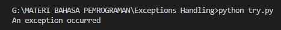
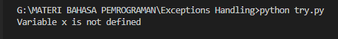
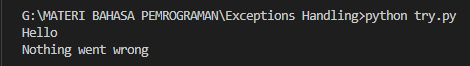

    # The try block will generate an exception, because x is not defined:
    try:
        print(x)
    except:
        print("An exception occurred")

    
    # Print one message if the try block raises a NameError and another for other errors:
    try:
        print(x)
    except NameError:
        print("Variable x is not defined")
    except:
        print("Something else went wrong")
    

    # You can use the else keyword to define a block of code to be executed if no errors were raised:
    try:
        print("Hello")
    except:
        print("Something went wrong")
    else:
        print("Nothing went wrong")

